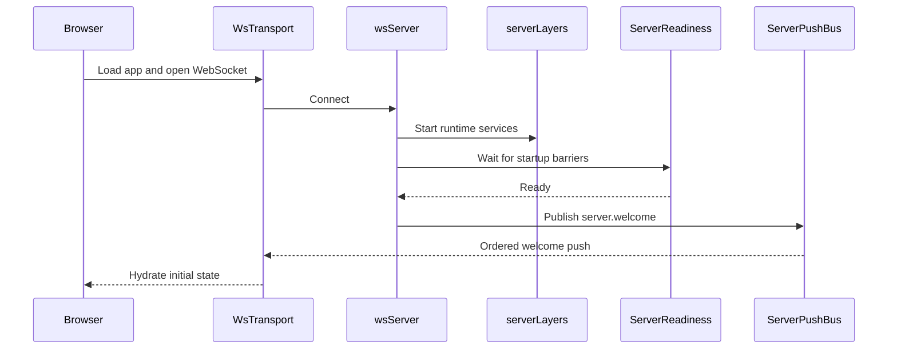
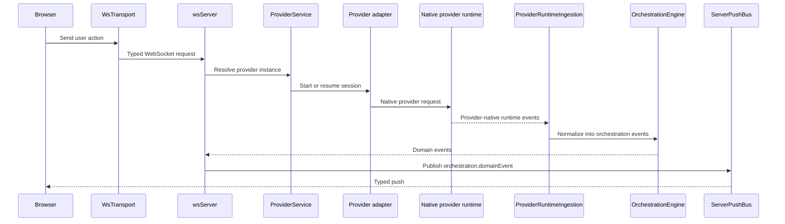
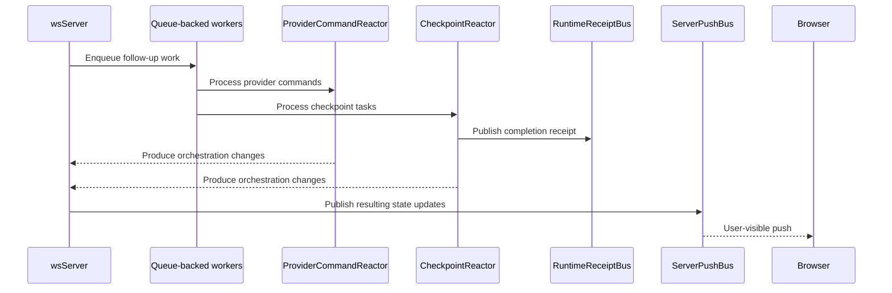
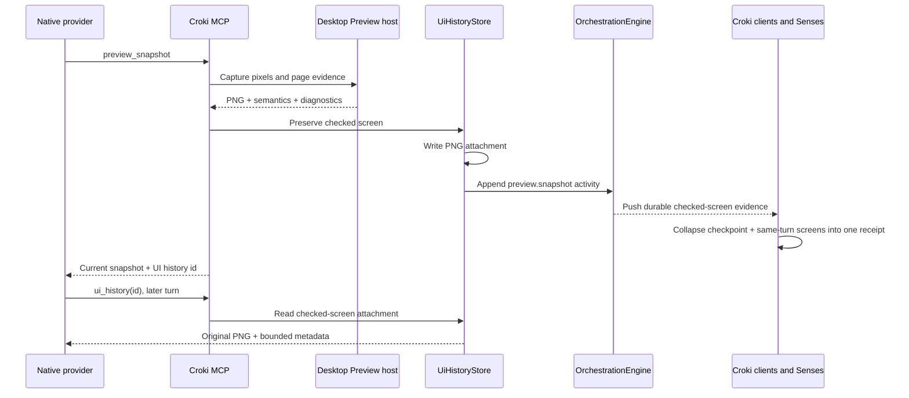

# Architecture

Croki runs a local server that owns projects, threads, provider sessions,
terminals, preview, Git state, checkpoints, and authenticated client access. It
serves a React web app and is embedded by the Electron desktop app. Provider
adapters translate native Codex, Claude, Cursor, Grok, OpenCode, and OpenClaw
events into one orchestration model without creating a second agent runtime.

```
┌─────────────────────────────────┐
│  Browser (React + Vite)         │
│  wsTransport (state machine)    │
│  Typed push decode at boundary  │
└──────────┬──────────────────────┘
           │ ws://localhost:3773
┌──────────▼──────────────────────┐
│  apps/server                    │
│  WebSocket + HTTP static server │
│  ServerPushBus (ordered pushes) │
│  ServerReadiness (startup gate) │
│  OrchestrationEngine            │
│  ProviderService                │
│  CheckpointReactor              │
│  RuntimeReceiptBus              │
└──────────┬──────────────────────┘
           │ provider-native SDK, app-server, or ACP
┌──────────▼──────────────────────┐
│  Configured coding-agent runtime│
└─────────────────────────────────┘
```

## Components

- **Browser app**: The React app renders session state, owns the client-side WebSocket transport, and treats typed push events as the boundary between server runtime details and UI state.

- **Server**: `apps/server` is the main coordinator. It serves the web app, accepts WebSocket requests, waits for startup readiness before welcoming clients, and sends all outbound pushes through a single ordered push path.

- **Provider runtime**: The selected provider does the actual agent/session work. `ProviderService` resolves a configured provider instance and its adapter, then translates provider-native events into Croki's orchestration model. See [Provider architecture](./providers.md).

- **Croki overlay**: Optional project-root application lineage supplies bounded released and building product/GTM facts to provider turns. A separate bounded project-activity packet gives a turn source-labelled awareness of sibling Thread state, branches, latest checkpoint files, and exact overlap without copying transcripts. Croki Senses derive disposable Perception Frames from native Thread, runtime, preview, checkpoint, approval, and source activity. Canvas may project those sources beside the Thread, but owns no provider, conversation, worktree, Review, memory, or execution runtime.

- **Background workers**: Long-running async flows such as runtime ingestion, command reaction, and checkpoint processing run as queue-backed workers. This keeps work ordered, reduces timing races, and gives tests a deterministic way to wait for the system to go idle.

- **Delegated workers**: Provider-native delegated conversations persist as child Threads with their own transcript and parent lineage. The parent stores only a `workerView` presentation choice: nested child chats or bounded Workstreams derived from parent lifecycle activity. Switching views never copies messages or changes provider behavior.

- **Runtime signals**: The server emits lightweight typed receipts when important async milestones finish, such as checkpoint capture, diff finalization, or a turn becoming fully quiescent. Tests and orchestration code wait on these signals instead of polling internal state.

- **UI history**: A successful model-driven Preview snapshot is copied into the server attachment store and recorded as ordinary Thread activity. The activity keeps bounded page metadata plus an attachment frame reference. Preview projects those checked screens for the founder, while the read-only `ui_history` MCP tool lets a later provider turn list or reopen the exact image. The web client collapses same-turn snapshots and checkpoint evidence into at most one checked/not-checked receipt after the answer. UI history owns no execution authority and does not create a second event store.

- **Server updates**: A connected environment advertises whether its server can replace itself. When client and server versions differ, web, desktop, and mobile select an automatic, desktop-managed, or manual update path without changing connection ownership. Launcher-managed servers stage the exact Croki package, park runtime roots, snapshot SQLite around migration trials, and commit or roll back before clients report completion. See [Server Update Architecture](./server-updates.md).

Related design:

- [Resource telemetry architecture](./resource-telemetry.md)

## Event Lifecycle

### Startup and client connect



1. The browser boots `WsTransport` and registers typed listeners in `wsNativeApi`.
2. The server accepts the connection in `wsServer` and brings up the runtime graph defined in `serverLayers`.
3. `ServerReadiness` waits until the key startup barriers are complete.
4. Once the server is ready, `wsServer` sends `server.welcome` from the contracts in `ws.ts` through `ServerPushBus`.
5. The browser receives that ordered push through `WsTransport`, and `wsNativeApi` uses it to seed local client state.

### User turn flow



1. A user action in the browser becomes a typed request through `WsTransport` and the browser API layer in `nativeApi`.
2. `wsServer` decodes that request using the shared WebSocket contracts in `ws.ts` and routes it to the right service.
3. [`ProviderService`][8] resolves the configured provider instance and starts or resumes its native session through the matching adapter.
4. Provider-native events are pulled back into the server by [`ProviderRuntimeIngestion`][9], which converts them into orchestration events.
5. [`OrchestrationEngine`][10] persists those events, updates the read model, and exposes them as domain events.
6. `wsServer` pushes those updates to the browser through `ServerPushBus` on channels defined in [`orchestration.ts`][11].

## Native provider rule

Croki's selected default is provider-native behavior. The shared runtime may
translate transport, persist threads, expose explicit tools, and attach visible
context, but it must not add hidden personas, planning loops, delegation
policies, or behavioral workflows. Those belong to explicit named harnesses
that are off by default.

When `.croki/application.croki` exists, `ProviderCommandReactor` reads it from
the canonical project root before every turn and prepends its bounded factual
lineage to the provider input. This works identically for GitHub-hosted, local
Git, and non-Git projects because release links and tags are optional evidence,
not runtime dependencies. The stored user message is not modified. Missing,
malformed, unsupported, oversized, or unreadable lineage fails open.

`ProviderCommandReactor` separately reads the current project perception before
each turn and builds a bounded sibling-Thread activity packet. The packet
contains observed coordination facts only, carries the project projection
revision and freshness state, and excludes Thread message bodies. Missing or
failed perception also fails open. This context helps native providers avoid
duplicated or conflicting work without imposing a Croki workflow or changing
the stored user message.

For a Thread whose branch is `croki/concept/<id>`, the reactor also reads
`.croki/concepts/<id>.croki` from the canonical project root before each turn.
The Concept is a self-describing boundary, so no central index participates in
resolution. The loader validates that file identity and branch agree, bounds
source and rendered sizes, escapes repository text, excludes archived state,
and fails open. This keeps Concept perception shared across worktrees without
turning `.croki` data into instructions or changing the stored user message.

Croki keeps the native-provider rule for all runtimes. Product is the single
explicit one-turn ideation harness and combines product and market judgment;
historical Venture and split GTM turns remain readable. Canvas is the automatic
projection of native source activity through Croki Senses and does not change provider
behavior. OpenClaw connects
to the user's selected Gateway agent through ACP and does not impose a Croki
coordination profile. See [Current project state](../project/current-state.md).

### Async completion flow



1. Some work continues after the initial request returns, especially in [`ProviderRuntimeIngestion`][9], [`ProviderCommandReactor`][13], and [`CheckpointReactor`][14].
2. These flows run as queue-backed workers using [`DrainableWorker`][16], which helps keep side effects ordered and test synchronization deterministic.
3. When a milestone completes, the server emits a typed receipt on [`RuntimeReceiptBus`][15], such as checkpoint completion or turn quiescence.
4. Tests and orchestration code wait on those receipts instead of polling git state, projections, or timers.
5. Any user-visible state changes produced by that async work still go back through `wsServer` and `ServerPushBus`.

### UI history flow



History persistence is best effort relative to the current snapshot: a storage
failure is logged and reported as `saved: false`, but does not hide the page the
provider just inspected. Missing historical images return an honest unavailable
result. A checked receipt means at least one same-turn screen exists; it does
not claim complete visual or interaction coverage.

[8]: ../../apps/server/src/provider/Layers/ProviderService.ts
[9]: ../../apps/server/src/orchestration/Layers/ProviderRuntimeIngestion.ts
[10]: ../../apps/server/src/orchestration/Layers/OrchestrationEngine.ts
[11]: ../../packages/contracts/src/orchestration.ts
[13]: ../../apps/server/src/orchestration/Layers/ProviderCommandReactor.ts
[14]: ../../apps/server/src/orchestration/Layers/CheckpointReactor.ts
[15]: ../../apps/server/src/orchestration/Layers/RuntimeReceiptBus.ts
[16]: ../../packages/shared/src/DrainableWorker.ts
